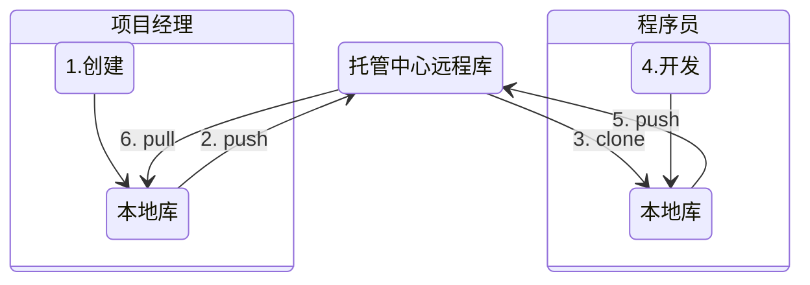
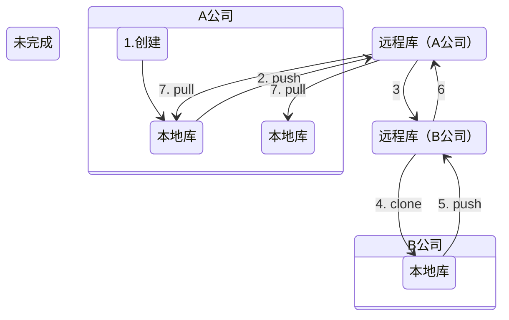

### 一. 安装Git


### 二. Git结构

#### 本地机构

``````mermaid
graph TD
A[工作区]-->|$ git add|B[暂存区]-->|$ git commit|C[本地库]
``````

### 三. 代码托管中心

它的任务是维护远程库。

本地库与远程库的交互方式分为两种：

1. 团队内部协作



> 2. 最开始远程库中没有内容。文件和目录，历史记录等全在本地库，需要项目经理将本地库的内容推送到远程库。
> 3. 程序员需要将远程库的内容克隆到本地库：下载远程库中的内容还会将本地库初始化好，带有初始化创建本地库的操作。
>
> 5. 程序员写完代码后，也需要提交到本地库，然后再推送到远程库，但是不能随意推送，因为远程库是项目经理创建的，不能直接推送，要先加入团队，才有权限推送
> 6. 在程序员提交后，项目经理再将程序员提交的内容拉取到本地。


2. 跨团队合作




#### 托管中心类型

* 局域网环境：GitLab
* 互联网环境：GitHub


### 三. 初始化本地仓库

1. 创建一个文件夹

2. 打开Git终端`Git Bash Here`

3. 设置用户名和邮箱

   ```bash
   $ git config --global user.name "..."
   $ git config --global user.email "..."
   ```

4. 本地仓库的初始化操作

   ```bash
   $ git init
   ```


### 四. Git常用命令

#### (一) add 添加文件，commit 提交文件

1. 先创建一个文件"Demo.txt"

2. 将文件提交到暂存区

   ```bash
   $ git add Demo.txt
   ```

3. 将暂存区的内容提交到本地库

   ```bash
   $ git commit -m "这是我提交的第一个文件 Demo.txt" Demo.txt
   ```

4. **注意事项**：(1) 不放在本地仓库中的文件，git是不进行管理的。

   ```bash
   $ git add Test.txt
   fatal: not a git repository... 试图在非本地仓库的文件夹下添加文件将会失败
   ```

   (2) 即使放在本地仓库的文件，如果不通过add, commit命令添加，git也不会管理。


#### (二) status 查看工作区和暂存区的状态

1. 创建一个文件"Demo2.txt"，查看其状态

   ```bash
   $ git status
   untracked files: Demo2.txt
   ```

2. 然后将Demo2.txt提交到暂存区

   ```bash
   $ git add "Demo2.txt"
   ```

3. 再查看状态

   ```bash
   $ git status
   Changes to be committed: new file: Demo2.txt
   ```

4. 提交到本地库


   ```bash
   $ git commit -m "这是我提交的第二个文件 Demo2.txt" "Demo2.txt"
   ```

5. 修改Demo2.txt文件中的内容

6. 再查看状态

   ```bash
   $ git status
   Changes not staged for commit: modified: Demo2.txt
   ```

7. 将Demo2.txt重新添加到暂存区

   ```bash
   $ git add "Demo2.txt"
   $ git status
   Changes to be committed: modified: Demo2.txt
   ```

8. 然后提交到本地库

   ```bash
   $ git commit -m "修改了文件Demo2.txt中的内容" "Demo2.txt"
   ```

9. 提交完再查看状态

   ```bash
   $ git status
   nothing to commit, working tree clean
   ```


#### (三) log 由远到近显示提交日志

日志显示方式

1. 方式1

   ```bash
   $ git log 
   ```

2. 方式2

   ```bash
   $ git log --pretty=oneline
   ```

3. 方式3

   ```bash
   $ git log --oneline
   ```

4. 方式4

   ```bash
   $ git reflog
   HEAD@{数字}中的数字代表，指针回到当前这个历史版本需要走多少步
   ```


#### (四) reset 前进或后退历史版本

1. hard参数：本地库的指针移动的同时，重置暂存区，重置工作区。**最常用**。

   ```bash
   $ git reset --hard [索引]
   ```

2. mixed参数：本地库的指针移动的同时，重置暂存区，但是工作区不变。

   ```bash
   $ git reset --mixed [索引]
   ```

3. soft参数：本地库的指针移动的同时，暂存区、工作区都不变。

   ```bash
   $ git reset --soft [索引]
   ```

   

#### (五) 删除文件 找回本地库删除的文件

1. 新建文件”Test2.txt“

2. 将它add到暂存区

3. 提交到本地库

4. 删除工作区中的Test2.txt

5. 将删除操作同步到暂存区

6. 将删除操作同步到本地库

7. 查看日志reflog

8. 找回本地库中删除的文件，实际上就是将版本切换到刚才添加文件“Test2.txt“的那个历史版本即可

   ```bash
   $ git reset --hard [历史版本] 
   ```


### (六) diff 比较差异

1. 先创建一个文件"Test3.txt"，添加到暂存区，再提交到本地库

2. 更改工作区文件"Test3.txt"的内容，导致工作区与暂存区不一致，然后进行比对

   ```bash
   $ git diff Test3.txt
   ```

3. 总结

   ```bash
   $ git diff [文件名] # 用于比较同一文件在工作区与暂存区中的差异
   $ git diff # 用于比较工作区和暂存区中的所有文件的差异
   $ git diff HEAD(或版本号) [文件名] # 用于比较暂存区和本地库中的文件差异
   ```


### 五. 分支

#### (一) 什么是分支

1. 什么是分支
   在版本控制过程中,使用多条线同时推进多个任务. 这里说的多条线,就是多个分支
2. 分支的好处
   同时多个分支可以并行开发,互相不影响,提高开发效率
   如果有一个分支功能开发失败,直接删除这个分支即可,不会对其他分支产生影响

#### (二) 操作分支

1. 在工作区创建一个“Test4.txt”文件, 然后提交到暂存区, 提交到本地库

2. 查看分支

   ```bash
   $ git branch -v # 当前只有一个master分支
   * master
   ```

3. 创建分支

   ```bash
   $ git branch br01
   ```

4. 再次查看分支

   ```bash
   $ git branch -v # 存在两个分支, 现在在master分支上
     br01
   * master
   ```

5. 切换到br01分支上

   ```bash
   $ git checkout br01
   $ git branch -v # 已切换到br01
   * br01
     master
   ```

6. 在br01分支上, 为文件“Test4.txt”增加以下内容

   ```
   abc
   added by br01
   ```

7. 将文件“Test4.txt”添加到本地库

   ```bash
   $ git status
   On branch br01
   
   $ git add Test4.txt
   
   $ git commit -m "在分支01中添加内容" Test4.txt
   ```

8. 切换到master分支

   ```bash
   $ git checkout master
   
   $ git branch -v
     br01
   * master
   ```

9. 在主分支上, 为文件“Test4.txt”增加以下内容

   ```
   abc
   added by master
   ```

10. 将文件“Test4.txt”添加到本地库

    ```bash
    $ git status
    On branch master
    
    $ git add Test4.txt
    
    $ git commit -m "在主分支中添加内容" Test4.txt
    ```

11. 将br01分支 合并到 主分支 (解决分支间冲突)

    ```bash
    # 先要进入主分支
    $ git checkout master
    
    $ git merge br01
    CONFLIT (content): Merge conflict in Test4.txt
    
    (master | MERGING) # 现在处于合并状态
    $ cat Test4.txt
    abc
    <<<<<<<< HEAD
    added by master
    ========
    added by br01
    >>>>>>>> br01
    
    # 总结: 什么时候会和出现冲突问题? 在同一个文件的同一个位置修改
    ```

12. 解决合并冲突, 需要开发团队内部商议解决

13. 将解决了冲突的“Test4.txt”添加到本地库

    ```bash
    $ git add Test4.txt
    
    $ git commit -m "解决了冲突问题" Test4.txt
    fatal: cannot do a partial commit during a merge.
    # 这里不可以带文件名, 否则出错
    
    $ git commit -m "解决了冲突问题" 
    
    (master) # 提交成功后, 合并状态将会恢复
    ```

### 六. 远程库操作 (开发团队内部)

#### (一) 创建远程库 (项目经理)

#### (二) 在本地创建远程库地址的别名

1. 远程库地址比较长, 每次复制比较麻烦. 可在Git本地通过别名保存地址.

2. 查看已有的别名.

   ```bash
   $ git remote -v # 现无别名
   ```

3. 取别名为origin (可任意取)

   ```bash
   $ git remote add origin https://....git
   ```

4. 查看已有的别名.

   ```bash
   $ git remote -v
   origin https://....git (fetch) 
   origin https://....git (push)
   ```

#### (三) 推送操作 (项目经理)

1. 使用push推送

   ```bash
   # git push [远程库别名] [要推送的分支, 选择一个分支即可]
   $ git push origin master
    * [new branch]     master -> master
   
   # [new branch] 表示在远程库中创建了新的分支
   # master -> master 表示将本地的master分支内容提交到了远程库的master分支
   ```

#### (四) 克隆操作 (程序员)

1. 使用clone克隆

   ```bash
   $ git clone https://....git # 远程库的地址
   ```

2. 克隆操作可以完成

   1. 初始化本地库
   2. 将远程库内容完整克隆到本地
   3. 自动创建远程库的别名

#### (五) 邀请加入团队 及推送操作 (程序员)

1. 更新工作区内容, 然后添加到暂存区, 并提交到本地库

2. push内容到远程库中, 但发现出错

   ```bash
   $ git push origin master
   remote: Permission denied...
   fatal : unable to access
    requested URL returned error: 403
    # 出错的原因: 项目经理必须邀请程序员加入团队
   ```

3. 项目经理邀请完程序员, 且程序员接受了邀请, 再次执行2的步骤, 进行推送, 成功.

#### (六) 拉取操作 (项目经理)

1. pull操作 = fetch + merge

2. 项目经理先确认远程库的内容是否更新了

3. 进行拉取 (对于远程库来说是个读取的操作, 因此不需要密码)

   ```bash
   # 先是抓取操作 fetch
   # git fetch [远程库别名] [远程库上对应的分支]
   $ git fetch origin master
   # 在抓取操作执行后, 只是将远程库的内容下载到本地, 但是工作区中的文件并没有更新. 
   ```

4. 抓取后, 项目经理可以将分支切换到远程库看看内容是否正确.

   ```bash
   $ git checkout origin/master
   $ ll
   $ cat Demo.txt
   ```

5. 确定内容正确以后, 就可以进行合并. 

   ```bash
   # 合并之前应该将分支切换回来
   $ git checkout master
   $ git merge origin/master
   ```

6. 以上的拉取操作(fetch+merge), 可直接利用pull命令来代替. 

   ```bash
   $ git pull origin master
   ```

7. 总结: 
   为了保险慎重, 可使用 fetch + merge 操作
   代码简单, 图省事, 可使用 pull 操作

#### (七) 协同开发时冲突的解决方法

1. 程序员改动文件“Test.txt”的内容

   ```
   abc
   aaaaa by 程序员
   ```

2. 将改动推送到远程库

   ```bash
   $ git add Test.txt
   $ git commit -m "程序员更新了Test.txt" Test.txt
   $ git push origin master
   ```

3. 项目经理也改动文件“Test.txt”的内容 (在没有拉取最新改动的状态下)

   ```
   abc
   aaaaa by 项目经理
   ```

4. 将改动推送到远程库

   ```bash
   $ git add Test.txt
   $ git commit -m "项目经理更新了Test.txt" Test.txt
   $ git push origin master
   Updates were rejected because the remote contains work that you do not have locally. This is usually caused by another repository pushing to the same ref. 
   
   # 推送失败. 在冲突的情况下, 先应该拉取最新的文件, 然后修改冲突, 再推送到远程服务器
   ```

5. 拉取最新的更新

   ```bash
   $ git pull origin master
   ```

6. 查看冲突内容, 并人为解决

   ```
   abc
   <<<<<< HEAD
   aaaaa by 项目经理
   =======
   aaaaa by 程序员
   ```

7. 项目经理提交解决了冲突的文件

   ```bash
   $ git add Test.txt
   $ git commit -m "解决了冲突问题"
   $ git push origin master
   ```

8. **如何避免冲突**
   (1) 团队开发的时候**避免在一个文件中修改代码**
   (2) 在本地修改一个文件前, 或在push之前, 先执行 pull 操作

#### (八) 本地库与远程库的交互 (使用IDEA)

1. 假如要将本地已有的库和远程已有的不同的库**强制合并**, 需要给命令行添加选项, 告诉git允许不相关历史合并.

   ```bash
   # 假如远程库的源是origin, 分支是master
   $ git pull origin master --allow-unrelated-histories
   
   # 这个方法只解决因为两个库有不同起始点(也就是两个库没有共同commit出现)所造成的无法提交.
   # 如果使用该方法依然无法提交, 需要看一下是不是发生了冲突, 解决后再提交
   ```

2. 相应地, 对不同起始点的远程库进行推送

   ```bash
   $ git push -u origin master -f
   ```

3. 接下来就可进行常规的本地库添加操作, 以及远程库的添加操作

   ```
   右键文件 Git -> add
   Git -> Commit File -> Commit
   Git -> Repository -> Push (之前可先定义远程库地址:Define remote)
   
   也可以一步完成Commit和Push
   Git -> Commit File -> Commit and Push
   但是不推荐, 因为一般在开发中先进行 pull 操作, 再 push 操作.
   ```

#### (九) 利用IDEA克隆远程库到本地

1. 本地新建项目

   ```
   File -> New -> Project form Version Control... -> Git
   ```

2. 克隆到本地后, 该目录既变成了本地库, 又变成了项目的工作空间.
   

3. 

